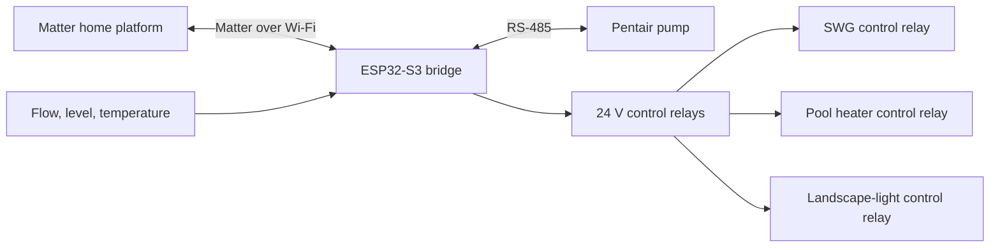

# Matter Pool Controller

> Local-first ESP32-S3 firmware that brings a Pentair IntelliFlo-compatible
> pump, relay-controlled equipment, and pool sensors into Matter.

This is the firmware for a DIY pool-equipment controller built around the
[Waveshare ESP32-S3 Relay 6CH](https://www.waveshare.com/product/esp32-s3-relay-6ch.htm).
It appears to Apple Home and other Matter platforms as one bridge with a pump,
six relay channels, and optional temperature, water-level, and flow sensors.

There is no cloud synchronization, telemetry upload, remote logging, or OTA
update client. Commands stay between the controller and the Matter fabric that
commissions it.

**Matter platforms:** Apple Home | Amazon Alexa | Google Home

**Contents:** [What it does](#what-it-does) · [Quick start](#quick-start) ·
[Hardware and wiring](#hardware-and-wiring) · [Commissioning](#commissioning) ·
[Safety](#safety) · [Project layout](#project-layout) · [Support development](#support-development)

## What It Does

- Controls a Pentair IntelliFlo-compatible variable-speed pump over RS-485.
- Exposes pump speed as a Matter dimmable plug-in unit, scaled to the
  configured RPM range.
- Exposes six relay channels as Matter on/off plug-in units.
- Supports optional dry-contact water-level and flow switches, plus DS18B20
  temperature probes.
- Includes a serial recovery console and a physical factory-reset path.
- Starts with every relay inactive and turns relays off before factory reset.



## Quick Start

### 1. Gather the hardware

You will need the [Waveshare ESP32-S3 Relay 6CH](https://www.waveshare.com/product/esp32-s3-relay-6ch),
an RS-485 connection to the compatible pump, and any sensors or external
contactors required by your installation. See [Hardware and wiring](#hardware-and-wiring)
before connecting equipment.

### 2. Install the toolchain

This project targets ESP-IDF 6.0.2 with esp-matter installed separately. The
included environment helper assumes these locations:

```text
~/.espressif/v6.0.2/esp-idf
~/esp/esp-matter
```

Change `env.sh` if your SDKs live elsewhere, then source it from the project
root:

```sh
. ./env.sh
```

### 3. Set the controller identity

Edit `main/board/board_identity.h` before flashing each physical controller.
Set a unique `BOARD_DEVICE_ID`, Matter setup PIN, and discriminator. Do not
reuse the included development defaults on an untrusted network or for a device
that will be handed to someone else.

The Matter vendor and product IDs in `main/matter/matter_setup.cpp` are also
development placeholders. Obtain assigned IDs before distributing a commercial
product.

### 4. Build and flash

```sh
idf.py set-target esp32s3
idf.py build
idf.py flash monitor
```

On the first boot, use the displayed Matter pairing information to commission
the bridge into your preferred Matter platform.

## Hardware and Wiring

### Board connections

The board-specific assignments live in `main/board/board_pins.h`.

| Connection | Pins |
| --- | --- |
| RS-485 pump bus | RX GPIO 18, TX GPIO 17 |
| Relay outputs | GPIO 46, 45, 42, 41, 2, 1 |
| Sensor inputs | GPIO 4, 5, 6, 7 |
| Boot button | GPIO 0 |
| Buzzer | GPIO 21 |
| RGB status LED | GPIO 38 |

### Sensor references

| Purpose | Amazon search | What to verify |
| --- | --- | --- |
| Temperature | `waterproof DS18B20 temperature sensor` | It uses the [DS18B20 one-wire sensor](https://www.analog.com/en/products/ds18b20.html). |
| Water level | `vertical float switch 24V dry contact` | It is a low-voltage dry-contact switch; compare with the [Flowline Switch-Tek LV10 specification](https://www.flowline.com/product/switch-tek-lv10-vertical-buoyancy-liquid-level-switch/). |
| Flow | `inline water flow switch 24V dry contact` | It is rated for your plumbing, pressure, and fluid; use the [Gems FS-550 specification](https://www.gemssensors.com/products/FS-550/30640) as a reference. |

For low-voltage field sensor runs, 18/10 direct-burial sprinkler cable is a
practical choice when its printed voltage and environmental ratings match the
installation. Do not treat sprinkler cable as a universal mains-voltage cable.

## Commissioning

At the serial prompt, use these commands during installation and service:

| Command | Result |
| --- | --- |
| `help` | Lists available commands. |
| `matter-info` | Prints Matter commissioning information. |
| `reset` | Reboots without clearing configuration. |
| `factory-reset` | Turns relays off, clears Matter configuration, and reboots. |

## Safety

Pool equipment combines water, mains power, and high-current loads. Treat this
controller as low-voltage control hardware, not as a mains switching panel.

- Use the onboard relay channels only for 24 V or lower control circuits.
- Use a properly rated external contactor for a saltwater chlorine generator,
  pump, heater, lights, or any other mains-voltage load. The controller relay
  should switch the contactor coil, not the load.
- Sensor inputs are for low-voltage sensors only.
- Verify relay polarity, RS-485 pump wiring, and the pump protocol with
  equipment disconnected where practical.
- Have all mains-voltage and contactor work completed by a qualified
  electrician and follow local electrical and pool-equipment requirements.

## Project Layout

```text
main/app/             Startup order and shared runtime state
main/board/           Board pins and per-device Matter identity defaults
main/console/         UART recovery and commissioning commands
main/io/              Relays, sensors, LED/buzzer, and reset button
main/matter/          Matter bridge and endpoint setup
main/platform/        ESP-IDF compatibility workarounds
main/pump/            Pentair protocol and pump control
docs/ARCHITECTURE.md  Runtime flow, boundaries, and safety model
```

The [module guide](main/README.md) describes ownership boundaries; the
[architecture guide](docs/ARCHITECTURE.md) explains runtime flow and safety
decisions.

## Security and Contributions

Do not commit certificates, private keys, generated `sdkconfig`, build outputs,
or device-specific commissioning values. Keep the controller on a trusted
network and use the physical factory-reset action before transferring it.

Read [CONTRIBUTING.md](CONTRIBUTING.md) before opening a pull request, and use
[SECURITY.md](SECURITY.md) for responsible vulnerability reports. The project
also includes a [Code of Conduct](CODE_OF_CONDUCT.md).

## Support Development

This repository remains the complete local-only controller firmware. For a
ready-to-install controller with a hosted dashboard, historical equipment data,
remote firmware updates, and on-demand diagnostics, see
[Pool Conductor](https://poolconductor.com). Choosing the finished controller
helps fund continued work on the open-source firmware.
