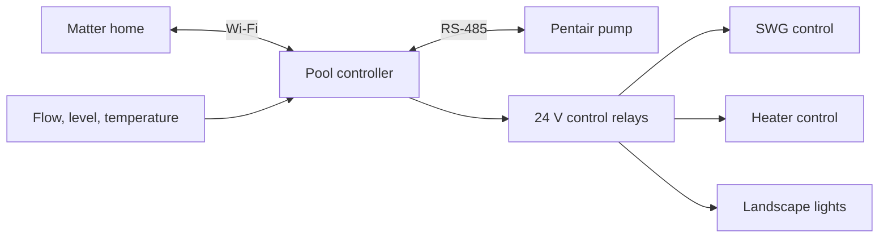

# Matter Pool Controller

> A DIY ESP32-S3 controller for bringing your pool pump, equipment relays, and
> optional sensors into Matter.

This is the local-only firmware for a pool controller built around the
[Waveshare ESP32-S3 Relay 6CH](https://www.waveshare.com/product/esp32-s3-relay-6ch.htm).
It talks to a Pentair IntelliFlo-compatible pump over RS-485, gives you six
relay outputs, and can read temperature, water-level, and flow sensors.

Pair it with Apple Home, Alexa, Google Home, or another Matter controller and
run your pool gear from the same place as the rest of your home. There is no
cloud account, subscription, or internet connection required after setup.

**Jump to:** [Shopping list](#shopping-list) | [Build the panel](#build-the-panel) |
[Firmware setup](#firmware-setup) | [Flash and pair](#flash-and-pair) |
[Serial commands](#serial-commands)

## What You Get

- Pump speed control for a Pentair IntelliFlo-compatible variable-speed pump.
- Six Matter relay switches for equipment such as an SWG, heater, valves, or
  landscape lights.
- Optional water-level, flow, and DS18B20 temperature sensors.
- A physical factory reset and a small serial console for setup and recovery.
- A setup that starts with every relay off.



## Shopping List

### Core parts

| Part | What to get it for |
| --- | --- |
| [Waveshare ESP32-S3 Relay 6CH](https://www.waveshare.com/product/esp32-s3-relay-6ch.htm) | The controller itself: ESP32-S3, six relays, and RS-485 in one board. |
| [VEVOR weatherproof junction box](https://www.vevor.com/electrical-enclosure-c_10749/vevor-outdoor-electrical-junction-box-13-78-x-9-84-x-5-90-in-abs-plastic-electrical-enclosure-box-with-hinged-cover-stainless-steel-latch-ip67-dustproof-waterproof-for-outdoor-electrical-projects-p_010661475587) | A 13.78 x 9.84 x 5.90 inch box that fits the build well. Do not go smaller than 11 x 8 inches. |
| Two 35 mm DIN rails | One is for the low-voltage side and controller wiring. The other is for your contactors and higher-voltage wiring. |
| [24 V, 2.5 A DIN-rail power supply](https://www.amazon.com/HDR-60-24-Step-Shape-Supply-24Volt-2-5Amp/dp/B0CLGRMKBM) | Powers the ESP32 relay board, contactor coils, and 24 V gear like valves. |
| 18/10 sprinkler cable | Great for sensors and 24 V relay-control wiring. It is thicker than Ethernet and gives you extra conductors to work with. |
| 24 V contactors or control relays | Pick units that make sense for the equipment you want to control: SWG, heater, landscape lights, valves, and so on. |
| RS-485 wiring for the pump | Connects the controller to the Pentair pump communication bus. |

### Optional sensors

You do not need any sensors for the controller to work. Add one, all three, or
none at all.

| What you want to measure | Search Amazon for | Make sure it is |
| --- | --- | --- |
| Water temperature | `waterproof DS18B20 temperature sensor` | A [DS18B20](https://www.analog.com/en/products/ds18b20.html) one-wire probe. |
| Water level | `vertical float switch 24V dry contact` | A low-voltage dry-contact switch; the [Flowline Switch-Tek LV10](https://www.flowline.com/product/switch-tek-lv10-vertical-buoyancy-liquid-level-switch/) is a useful reference. |
| Water flow | `inline water flow switch 24V dry contact` | Rated for your plumbing and pressure; the [Gems FS-550](https://www.gemssensors.com/products/FS-550/30640) shows the kind of switch to look for. |

## Build the Panel

Start with the enclosure. The VEVOR box above is large enough for two DIN
rails, a 24 V power supply, the controller, and a clean split between the
low-voltage and higher-voltage sides. That extra room matters once you start
adding contactors and wiring.

Put the controller, 24 V power supply, sensor wiring, and relay-control wiring
on one side. Put the contactors and their load wiring on the other. The 24 V
power supply feeds the ESP32 relay board, contactor coils, and any 24 V gear
you are adding.

Keep the board relays on the low-voltage side of the job. They are for 24 V
control circuits, control inputs, and contactor coils. For anything that runs
on mains power, like an SWG, pump, heater, or landscape transformer, use the
right external contactor or control input for that equipment. The controller
tells that gear what to do; it does not carry its 120 V or 240 V load.

### Board wiring

These are the pins used by the firmware. You mainly need this table when you
are checking wiring or moving to a different board.

| What | Pins |
| --- | --- |
| RS-485 pump bus | RX GPIO 18, TX GPIO 17 |
| Relay outputs | GPIO 46, 45, 42, 41, 2, 1 |
| Sensor inputs | GPIO 4, 5, 6, 7 |
| Boot button | GPIO 0 |
| Buzzer | GPIO 21 |
| RGB status LED | GPIO 38 |

## Firmware Setup

### Give the controller its own identity

Before you flash a board, open `main/board/board_identity.h`. Give it its own
`BOARD_DEVICE_ID`, Matter setup PIN, and discriminator. The values in the repo
are development defaults, so do not reuse them for every board.

The Matter vendor and product IDs in `main/matter/matter_setup.cpp` are also
placeholders. If you are making and selling controllers, get real assigned IDs
first.

### Tell the firmware about sensors

Sensors are configured in the source, not from a web page. Open
`main/board/board_sensor_config.h`, pick the sensor type for the port you used,
give it a name, then rebuild and flash.

For example, this makes the second sensor port a flow switch named `Pump Flow`
and stops relay commands when the switch is open:

```cpp
{Type::FlowSwitch, "Pump Flow", true},
```

Leave unused ports as `Disabled`. Use one port for each sensor type: one flow
switch, one float switch, and one temperature probe.

## Flash and Pair

This project uses ESP-IDF 6.0.2 and esp-matter. The included `env.sh` assumes
they are installed here:

```text
~/.espressif/v6.0.2/esp-idf
~/esp/esp-matter
```

If yours live somewhere else, update `env.sh`. Then, from this folder:

```sh
. ./env.sh
idf.py set-target esp32s3
idf.py build
idf.py flash monitor
```

On its first boot, the controller prints its Matter pairing information. Add it
to your Matter home from there.

## Serial Commands

Plug in over USB and use the serial prompt when you need to check setup or get
back to a clean slate.

| Command | What it does |
| --- | --- |
| `help` | Shows the available commands. |
| `matter-info` | Prints the Matter pairing information again. |
| `reset` | Restarts the controller without forgetting anything. |
| `factory-reset` | Turns off the relays, clears Matter, and restarts. |

## How the Code Is Laid Out

```text
main/app/             Startup and the main loop
main/board/           Board pins, device identity, and sensor setup
main/console/         USB serial commands
main/io/              Relays, sensors, LEDs, buzzer, and reset button
main/matter/          Matter bridge and devices
main/platform/        ESP-IDF compatibility bits
main/pump/            Pentair protocol and pump control
docs/ARCHITECTURE.md  More detail about how the pieces fit together
```

The [module guide](main/README.md) and
[architecture guide](docs/ARCHITECTURE.md) are there if you want to change the
firmware instead of just configure it.

## Working on It

Please read [CONTRIBUTING.md](CONTRIBUTING.md) before sending a pull request.
Keep certificates, keys, generated `sdkconfig` files, build folders, and your
personal commissioning values out of Git. Use [SECURITY.md](SECURITY.md) for
security reports.

## Support Development

This repo is the complete local-only firmware. If you would rather buy a
ready-to-install controller with a hosted dashboard, history, remote updates,
and diagnostics, take a look at [Pool Conductor](https://poolconductor.com).
That helps support work on this open-source version too.
